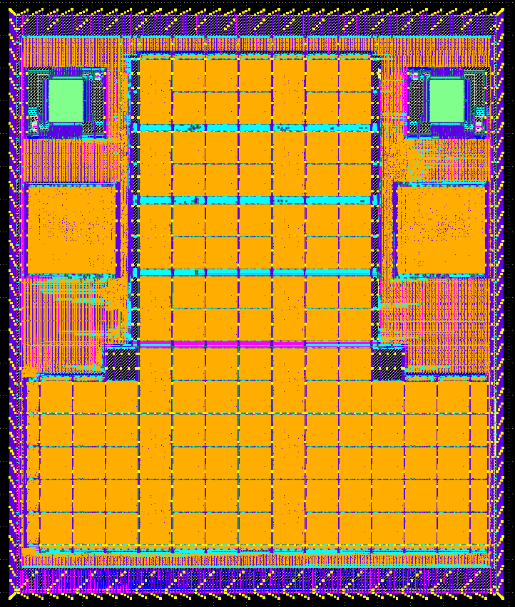

# FuseRISC2

  

   

   
   

Fuserisc2 is a Heterogeneous Multicore SoC, integrating a customised embedded FPGA fabric and two RISC-V cores (modified IBEX cores from LowRISC). The SoC uses two custom interconnects, one read the other read/write. These provide the cores with access to the SRAM and peripheral memory space. The Caravel subsystem interfaces via a wishbone to the RW interconnect, to access the FuseRISC2 address space. There is an alternative path to the SoC off chip via a custom UART to memory interface. LA and IO pins are used to provide control signals into the SoC for core and eFPGA management, these functions can also be accessed off chip. Both RISC-V cores are connected to the eFPGA fabric via a custom instruction interface (CIF). This interface uses the custom instruction window in the RISC-V specification and is encoded into the IBEX instruction decode unit. The CIF presents two operands from a core to the eFPGA fabric and enables the choice of three result paths. CIF instructions can use a flow control between the core and the fabric or use a delay. Both cores also have their interrupt hardware connected to the eFPGA, this enables dynamic core to core signalling. 
 

 

The eEPGA fabric has been arranged in a T shape to best utilise the available space. Cores and SRAMS are paired, with channels through the fabric to providing space to route the interconnect. 

 
The eFPGA fabric can be programmed off chip using the programming pin or via core one. Applications running on the risc-v cores would reconfigure the eFPGA fabric to contain a number of custom instructions. These can be accessed by an application executing the custom instruction. Instructions can be replaced dynamically at runtime. Dynamic instructions are implemented in software as intrinsics.
  

 
<b>FuseRisc2 generation</b>

The processor was generated using the FABulous eFPGA framework. The framework enables the user to specify the configuration of the cores, sram and eFPGA fabric with reduced engineer input compared to building RTL from scratch. We are currently porting the tensorflow micro software stack to enable the easy design and testing of AI accelerated codes on tightly coupled CPU eFPGA enabled SOC.
  

